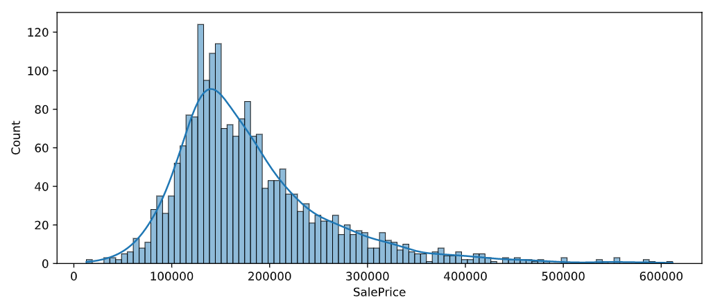
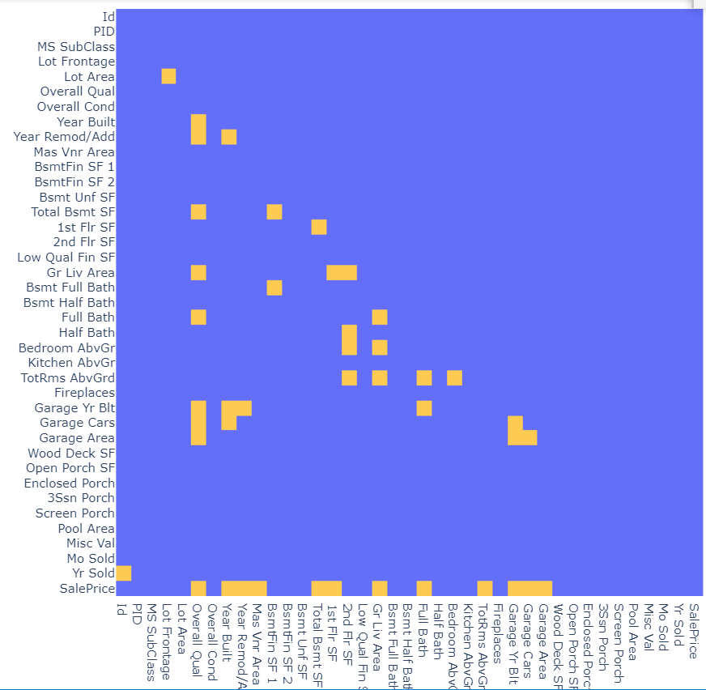
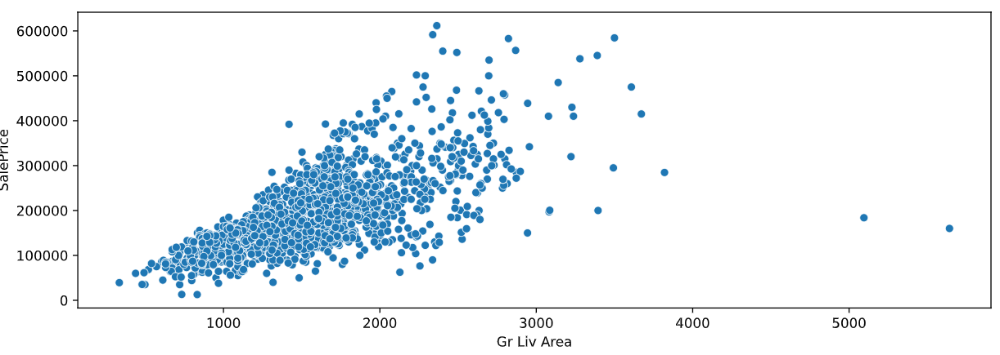
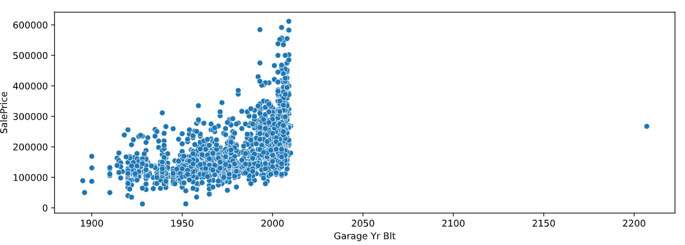
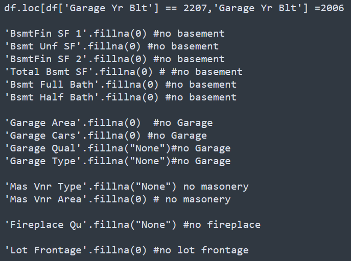
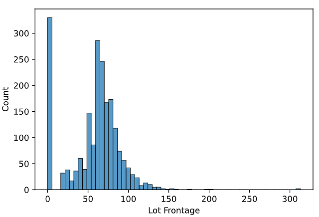
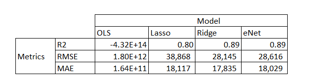

**Clement Galvier - Project 2 - Ames Housing Prices**

In this project we will dive into a dataset of 2000 records and 80 features related to the transaction price of houses in Ames, Iowa.

ABOUT Ames, Iowa

- Ames is a small town, home of the IOWA STATE UNIVERSITY
- From wikipedia, we learn that the median age in the city is 24yo ([https://en.wikipedia.org/wiki/Ames,_Iowa]())
- The average median income per household hovers around USD50k

# Problem Statement :

- We are tasked by the State University to evaluate the attractivity of the town for future University staff relocating with their family. We will look at what the average cost of a house is, and what are the key parameters to consider when buying one.

# File structure:

We will work with 2 notebooks: 1st one for the EDA, imputing, and feature trimming

2nd notebook will be for modelling.

Both notebooks are saved at the root of the folder, whereas the output eda file is stored in "Output" folder

---

## We will start with a throrough EDA

We got 80 features, 40 of which contains some nulls

Given the massive amount of features available, we will start trimming during the EDA phase

#### Missing values: Dropping large amounts

We will drop the ones with more than 50% missing values as their predictive power is severely impaired.

- Pool QC
- Misc Feature
- Alley
- Fence

#### Checking the distribution of the SalePrice

Nicely normally distributed, which is good for linear regression as we are looking for normality in our data.

We then check check what are the variable with a significant correlation coef (>=|0.5|)

The last row (SalePrice) is correlated to 12 variables

#### We decide to spend more time on these *12 numerical variables* and check their correlation to sales price 1 by 1

We realise that some have outliers like Gr Living Area

We also identify the garage year built

*Imputing choices*

- Gr Live Area: we leave it like that, these are just big houses
- Garage Yr Built: based on House yr built (2006)

*Imputing null values:*

All missing values and reasons for imputing this way:

Because of these choices, we skew the distribution of some variables, for instance Lot Frontage:

But it is necessary rather than leaving it null

We save the file in the "Output" folder

---

### Modelling

1. Linear regression generates poor results on test set (r2, MAE, RMSE), most likely due to overfitting
2. We try to address this using Lasso, which yields better R2 and smaller MAE. ()less features, less variance in the model)
3. we move on to Ridge, which yields better metrics than Lasso
4. we end up with ElasticNet which performs slightly better than both ridge and Lasso with an R2 of 0.76

### Metrics recap:

### Conclusion

The decision lies between enet and ridge, and **we accept Ridge as our model of reference** as it maximizes the r2 and minimizes RMSE and MAE

Ridge coefficients cannot be interpreted immediately, but their importance is their scale. The top 3 price predictors are Overall Quality,Gr Liv area, and whether or not the house is in NridgHt

With this, we would recommend future staff to look for the following key price determinants:

1. look at tier-2 quality houses
2. highlight the "cheaper" neighborhoods
3. downplay the ownership of a garage (it does drive the price up with a very positive beta). Encourage staff to cycle to work

### Future work

We will need to identify top features contributing to the postive R2 and run a model based on them only, to further reduce the variance

We will need to denormalize data using the invert_transform function for the StandardScaler module to be able to interpret the coefficients in a meangful way.

There are still some colineartiy in the model ( overall quality correlates with Overall condition, and some sqf features could be removed as their sum is already in the model)

Finally, we could look at more macro elements over the last 10 years ( economic trends, University of Iowa major events , labor market in Ames) to further explain the noise in our dataset
